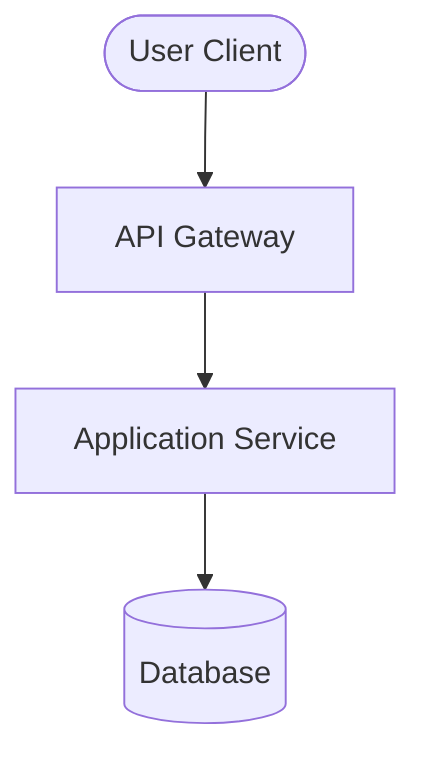

# Project Planning: [Project Title]

## Metadata
*   **Owner**: [Lead Engineer/Product Manager]
*   **Status**: Draft | In Review | Approved
*   **Created Date**: YYYY-MM-DD
*   **Target Release Date**: YYYY-MM-DD
*   **Tracking Ticket**: [Link to Jira/GitHub/Vikunja Issue]

---

## 1. Objective & Scope ("The What")

### 1.1 Executive Summary
[A concise 2-3 sentence overview of what is being built and why.]

### 1.2 In-Scope Features
*   [Feature 1]: [Brief description of MVP requirements]
*   [Feature 2]: [Brief description of MVP requirements]

### 1.3 Out-of-Scope (Non-Goals)
*   [Feature/Goal A]: [Explicitly stated non-goal to avoid scope creep]

### 1.4 Agent Guidelines & Checkpoints
Guidelines and checkpoints for AI agents executing this project plan:
*   **Security & Safety Gates**: [e.g., "Do not run migrations on a production database; verify locally first"]
*   **Pause & Align Checkpoints**:
    *   [ ] Checkpoint 1: [e.g., Database schema design complete (Request user review)]
    *   [ ] Checkpoint 2: [e.g., Core features implemented (Run tests and report results)]
    *   [ ] Checkpoint 3: [e.g., PR created (Provide PR walkthrough link)]

---

## 2. Problem Statement & Motivation ("The Why")

### 2.1 The Problem
[Describe the pain point, operational bottleneck, or business gap. What is wrong today?]

### 2.2 Expected Business/User Impact
[How will solving this problem benefit the users or organization? What metrics are we targeting?]

### 2.3 Alternatives to Building
*   **Do Nothing**: [What happens if we do not solve this?]
*   **Off-the-shelf SaaS / Pre-existing open source**: [Why is an existing third-party solution not suitable?]

---

## 3. Technical Architecture & Tech Stack ("The How")

### 3.1 Architecture Overview
[High-level system design details and component layouts.]

### 3.2 Data Flow & System Topology

### 3.3 Tech Stack Selection
*   **Frontend**: [Framework/Language]
*   **Backend**: [Framework/Language]
*   **Database/Storage**: [Technology]
*   **Infrastructure/Cloud**: [Services used]

---

## 4. Evaluated Alternatives & Decisions

| Technology Option | Pros | Cons | Recommendation / Decision |
| :--- | :--- | :--- | :--- |
| **Option A (Chosen)** | [Pros] | [Cons] | **Selected**: [Rationale] |
| **Option B** | [Pros] | [Cons] | **Rejected**: [Rationale] |

---

## 5. Project Milestones & Tasks (Living Backlog)
- [ ] **Phase 1: Proof of Concept / MVP**
  - [ ] Task 1.1: [Core backend setup]
  - [ ] Task 1.2: [Database schema migration]
- [ ] **Phase 2: Integration & Beta**
  - [ ] Task 2.1: [Frontend-backend integration]
  - [ ] Task 2.2: [Authentication setup]
- [ ] **Phase 3: Production Hardening**
  - [ ] Task 3.1: [Load testing and security scan]
  - [ ] Task 3.2: [CI/CD deployment pipeline validation]

---

## 6. Risks & Mitigation Strategies
*   **Risk 1**: [Description of technical, timeline, or operational risk]
    *   *Mitigation*: [Steps taken to prevent or respond to the risk]

---

## 7. Definition of Done (DoD)
*   [ ] **Code Quality**: Code matches active workspace style guidelines.
*   [ ] **Testing**: Unit test coverage meets gates (default: 85%), integration tests pass.
*   [ ] **Security**: Static analysis (SAST) passes, secret scanner shows no leaks.
*   [ ] **Documentation**: API endpoints documented; README updated.
*   [ ] **Validation**: Successfully tested on staging environment or local simulation.
